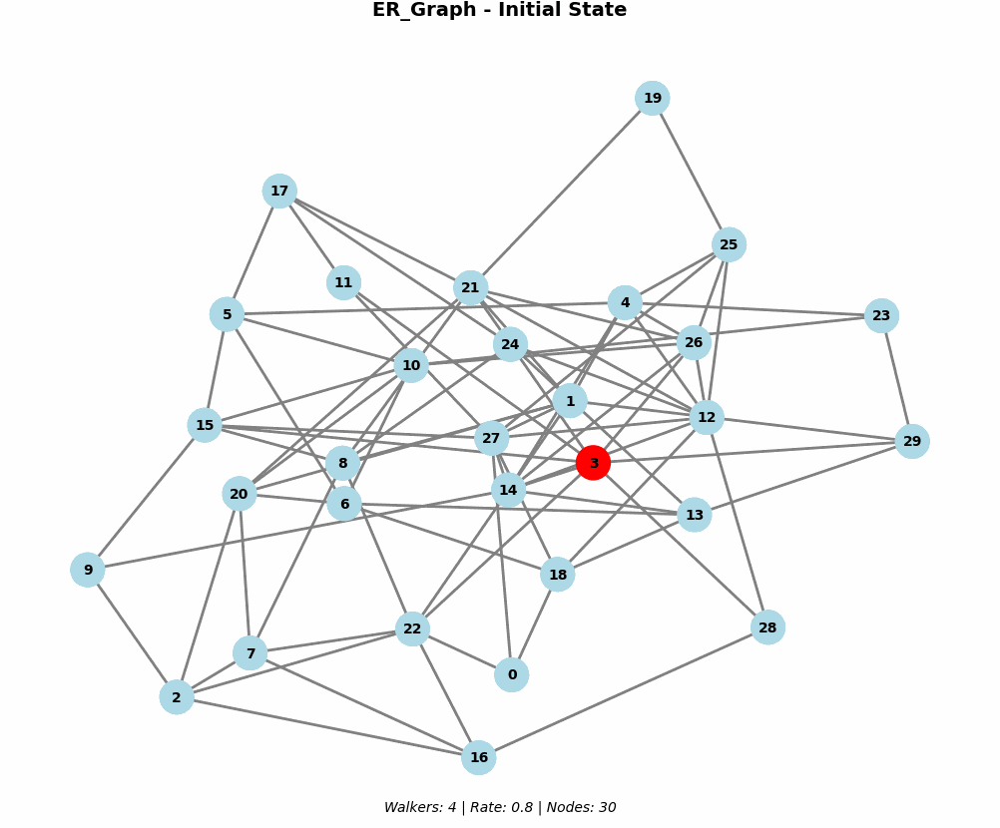
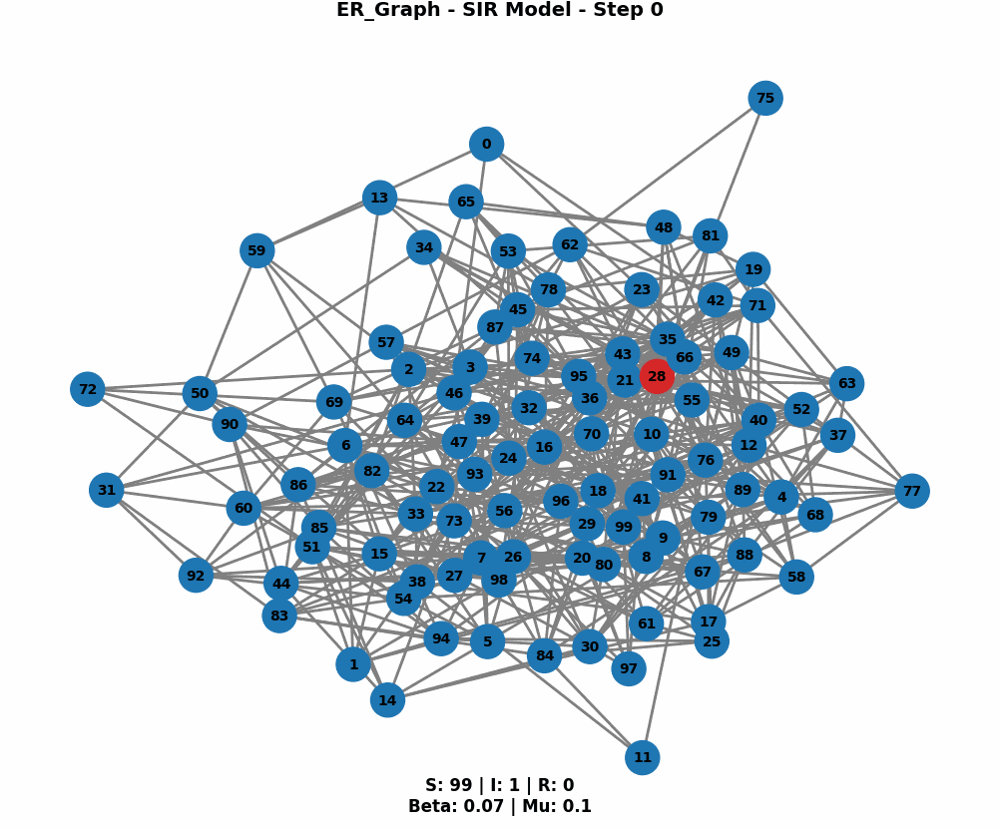

# Northeastern_PHYS7335
Collection of projects and assignments from Northeastern University's Dynamical Processes on Complex Networks course.

## Random Walks

Simulation and visualization of random walks on various graph topologies (Erdős-Rényi, Watts-Strogatz, Barabási-Albert, and Configuration Model).

### Visualization example



### Features

- **Stochastic Visualization**: Generates animated GIFs of random walkers on small graphs.
- **Stochastic Analysis**: Analyzes walker distribution and mixing times on small graphs.
- **Deterministic Analysis**: Performs "Degree Block" analysis on larger graphs (1000 nodes).
- **Graph Types**: Supports ER, WS, BA, and Configuration Model graphs.

### Installation

1. Clone the repo or download the directory.
2. Install dependencies:
   ```bash
   pip install -r requirements.txt
   ```

### Usage

#### Basic Usage
Run with default parameters (Walkers: 4, Rate: 0.80, Nodes: 30):
```bash
python RandomWalks.py
```

#### Custom Parameters
Customize the visualization parameters:
```bash
python RandomWalks.py --walkers 6 --rate 0.75 --nodes 50
```

#### Command-Line Options

| Flag | Short | Default | Description |
|------|-------|---------|-------------|
| `--walkers` | `-w` | 4 | Number of walkers (Stochastic Visualization) |
| `--rate` | `-r` | 0.80 | Rate of escape (0-1) for all analyses |
| `--nodes` | `-n` | 30 | Number of nodes (Stochastic Visualization) |
| `--help` | `-h` | - | Display help message |

#### Output

The script creates an `output/` directory containing:
- **GIFs**: Animations of the random walks (e.g., `ER_Graph_random_walks_animation.gif`).
- **Plots**:
    - `*_walkers_by_degree.png`: Walkers vs Degree.
    - `*_cumulative_walkers_by_time.png`: Cumulative walkers over time.
    - `mixing_time_combined.png`: Mixing time analysis.

#### Notes

- The **Stochastic Visualization** uses the parameters provided via command line.
- The **Deterministic Analysis** runs on hardcoded larger graphs (1000 nodes, 10000 walkers) to ensure statistical significance.

---

## SIR Epidemic Models

Exploration of the Susceptible-Infectious-Recovered (SIR) model through mathematical comparison and network-based simulation.

### Visualization example




### 1. Deterministic vs Stochastic Analysis (`SIR_Deterministic.ipynb`)

A Jupyter Notebook comparing the classic deterministic approach against stochastic simulations.

- **Mathematical Model**: Solves the system of discrete-time difference equations for $S(t)$, $I(t)$, and $R(t)$.
- **Comparison**: Contrasts the "average behavior" of infinite populations (Deterministic) with the variability of finite populations (Stochastic).
- **Parameter Sweeps**: Analyzes the effect of varying infection rates ($\beta$) on the epidemic curve.

### 2. Network Visualization (`SIRVisual.py`)

A Python module for simulating and visualizing SIR epidemics on complex networks. It visualizes the spread of infection node-by-node and compiles the frames into an animated GIF.
It is important to note that within `SIRVisual.py` we are incorrectly using beta, we should be using `beta = degree * infect_rate` but instead are not factoring in degree into beta. Instead we are rng'ing on each edge for probability beta for each timestep.

#### Features
- **Graph Generation**: Supports Erdős-Rényi (ER), Watts-Strogatz (WS), and Barabási-Albert (BA) topologies.
- **Visualization**: Coloring nodes based on state (Susceptible, Infectious, Recovered) over time.
- **GIF Export**: Automatically saves animations of the outbreak.

#### Usage

Run with default parameters (Nodes: 100, Beta: 0.3, Gamma: 0.1):
```bash
python SIRVisual.py
```

**Custom Parameters:**
```bash
python SIRVisual.py --nodes 200 --beta 0.5 --gamma 0.05 --steps 150
```

#### Command-Line Options

| Flag | Short | Default | Description |
|------|-------|---------|-------------|
| `--nodes` | `-n` | 100 | Number of nodes in the graph |
| `--beta` | `-b` | 0.3 | Infection probability ($S \to I$) |
| `--gamma` | `-g` | 0.1 | Recovery probability ($I \to R$) |
| `--steps` | `-s` | 100 | Number of simulation steps |
