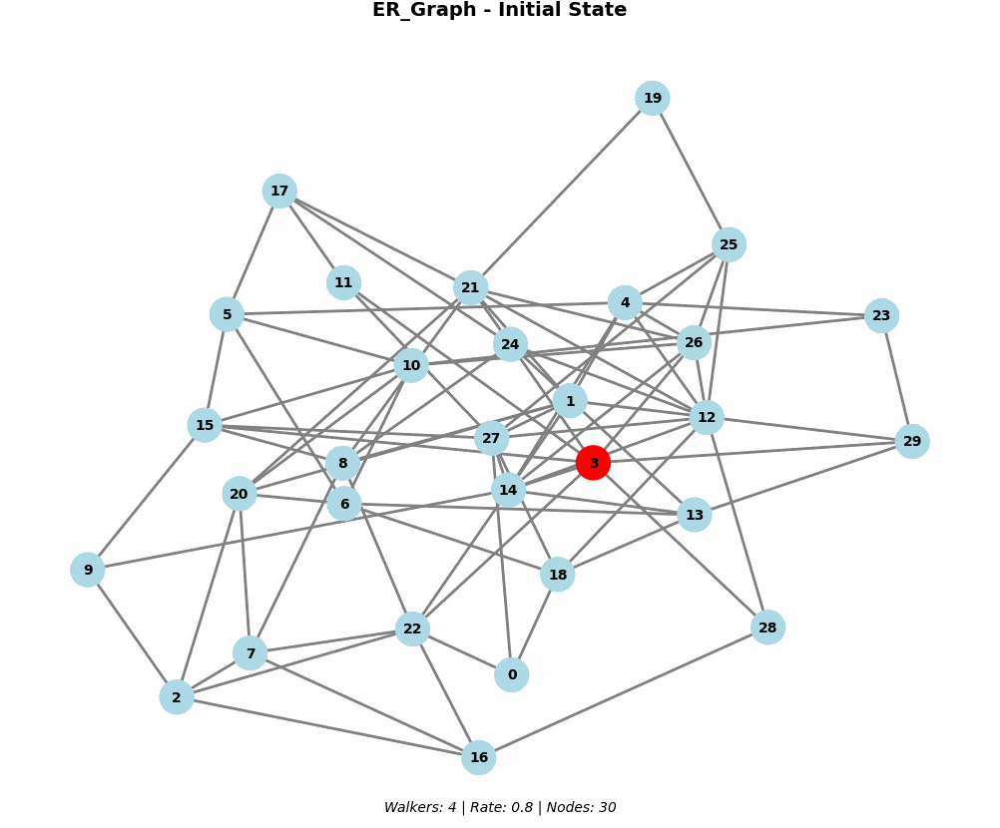
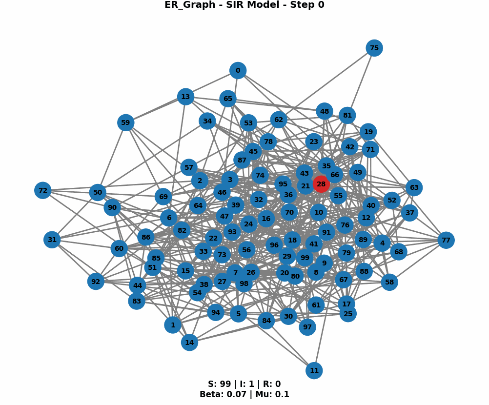
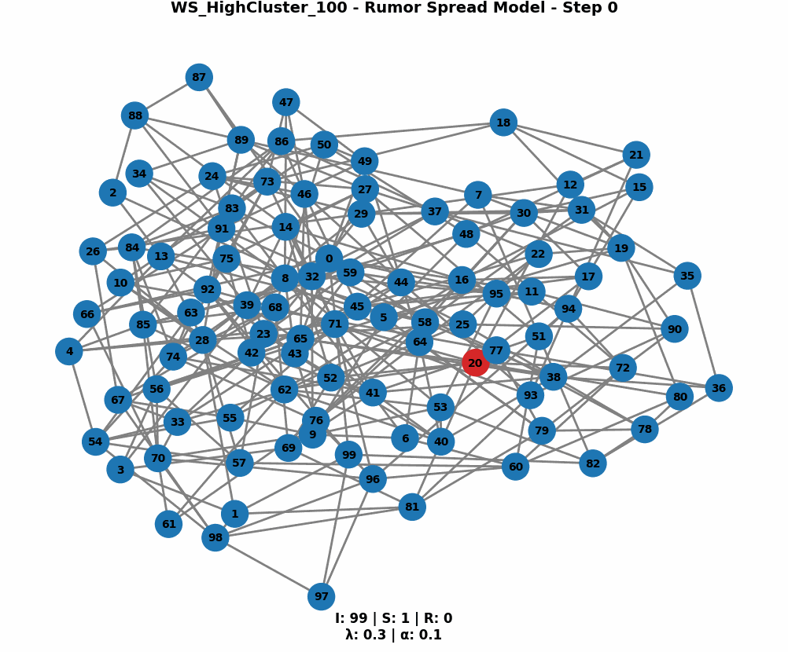
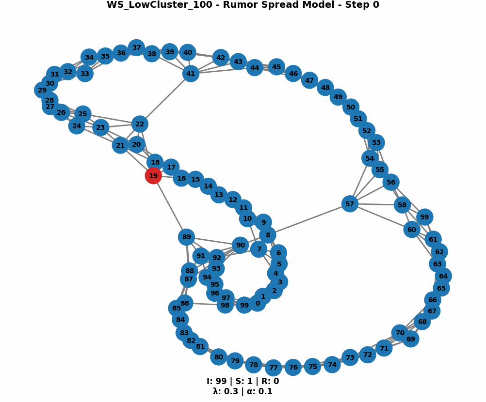

# Northeastern_PHYS7335
Collection of projects and assignments from Northeastern University's Dynamical Processes on Complex Networks course.

## Random Walks

Simulation and visualization of random walks on various graph topologies (Erdős-Rényi, Watts-Strogatz, Barabási-Albert, and Configuration Model).

### Visualization example



### Features

- **Stochastic Visualization**: Generates animated GIFs of random walkers on small graphs.
- **Stochastic Analysis**: Analyzes walker distribution and mixing times on small graphs.
- **Deterministic Analysis**: Performs "Degree Block" analysis on larger graphs (1000 nodes).
- **Graph Types**: Supports ER, WS, BA, and Configuration Model graphs.

### Installation

1. Clone the repo or download the directory.
2. Install dependencies:
   ```bash
   pip install -r requirements.txt
   ```

### Usage

#### Basic Usage
Run with default parameters (Walkers: 4, Rate: 0.80, Nodes: 30):
```bash
python RandomWalks.py
```

#### Custom Parameters
Customize the visualization parameters:
```bash
python RandomWalks.py --walkers 6 --rate 0.75 --nodes 50
```

#### Command-Line Options

| Flag | Short | Default | Description |
|------|-------|---------|-------------|
| `--walkers` | `-w` | 4 | Number of walkers (Stochastic Visualization) |
| `--rate` | `-r` | 0.80 | Rate of escape (0-1) for all analyses |
| `--nodes` | `-n` | 30 | Number of nodes (Stochastic Visualization) |
| `--help` | `-h` | - | Display help message |

#### Output

The script creates an `output/` directory containing:
- **GIFs**: Animations of the random walks (e.g., `ER_Graph_random_walks_animation.gif`).
- **Plots**:
    - `*_walkers_by_degree.png`: Walkers vs Degree.
    - `*_cumulative_walkers_by_time.png`: Cumulative walkers over time.
    - `mixing_time_combined.png`: Mixing time analysis.

#### Notes

- The **Stochastic Visualization** uses the parameters provided via command line.
- The **Deterministic Analysis** runs on hardcoded larger graphs (1000 nodes, 10000 walkers) to ensure statistical significance.

---

## SIR Epidemic Models

Exploration of the Susceptible-Infectious-Recovered (SIR) model through mathematical comparison and network-based simulation.

### Visualization example




### 1. Deterministic vs Stochastic Analysis (`SIR_Deterministic.ipynb`)

A Jupyter Notebook comparing the classic deterministic approach against stochastic simulations.

- **Mathematical Model**: Solves the system of discrete-time difference equations for $S(t)$, $I(t)$, and $R(t)$.
- **Comparison**: Contrasts the "average behavior" of infinite populations (Deterministic) with the variability of finite populations (Stochastic).
- **Parameter Sweeps**: Analyzes the effect of varying infection rates ($\beta$) on the epidemic curve.

### 2. Network Visualization (`SIRVisual.py`)

A Python module for simulating and visualizing SIR epidemics on complex networks. It visualizes the spread of infection node-by-node and compiles the frames into an animated GIF.
It is important to note that within `SIRVisual.py` we are incorrectly using beta, we should be using `beta = degree * infect_rate` but instead are not factoring in degree into beta. Instead we are rng'ing on each edge for probability beta for each timestep.

#### Features
- **Graph Generation**: Supports Erdős-Rényi (ER), Watts-Strogatz (WS), and Barabási-Albert (BA) topologies.
- **Visualization**: Coloring nodes based on state (Susceptible, Infectious, Recovered) over time.
- **GIF Export**: Automatically saves animations of the outbreak.

#### Usage

Run with default parameters (Nodes: 100, Beta: 0.3, Gamma: 0.1):
```bash
python SIRVisual.py
```

**Custom Parameters:**
```bash
python SIRVisual.py --nodes 200 --beta 0.5 --gamma 0.05 --steps 150
```

#### Command-Line Options

| Flag | Short | Default | Description |
|------|-------|---------|-------------|
| `--nodes` | `-n` | 100 | Number of nodes in the graph |
| `--beta` | `-b` | 0.3 | Infection probability ($S \to I$) |
| `--gamma` | `-g` | 0.1 | Recovery probability ($I \to R$) |
| `--steps` | `-s` | 100 | Number of simulation steps |

### 3. SLIR Model Exploration (`SLIR_Slim.ipynb`)
   * Exploration and implementation of the Susceptible-Latent-Infectious-Recovered (SLIR) model.
   * **Model Expansion:** Adds a "Latent" compartment to the classic SIR model, capturing the delay between exposure and infectiousness.
   * **Deterministic vs Stochastic:** Implements difference equations and simulations contrasting theoretical latent progression against random agent-level variation.

### 4. Competing Epidemics (`SI_Comp_SII.ipynb`)
   * Investigates multi-strain/competing disease dynamics using pure Susceptible-Infectious models.
   * **SI/SII Framework:** Analyzes systems where multiple variants or pathogens compete and spread through a population simultaneously.
   * **Evolution of Infection:** Observes the competitive advantage of variants and evolution of the pathogen across populations over time.

### 5. Second Epidemic Wave (`SIR_Second_Epidemic.ipynb`)
   * Examines the mathematical occurrence and behavior of a renewed outbreak.
   * **Repeat Infection Modeling:** Simulates a second wave ("repeat epidemic") of infection within the SIR framework.
   * **Comparative Analysis:** Contrasts deterministic expectations of trailing epidemic waves with stochastic realities and sudden resurgences.

### 6. Growth Rate Analysis (`Growth_rate.ipynb`)
   * Focuses on the comparative growth metrics between simple and delayed-onset viral trajectories.
   * **SEIR vs SIR Comparison:** Evaluates and contrasts the mathematical growth curves of models with an "Exposed" period against those without.
   * **Metric Extraction:** Directly calculates and plots infected population growth rates mapped against various transmission ($\beta$) coefficients.

### 7. Agent-Based Network Modeling (`Agent_based.ipynb`)
   * Granular approach explicitly controlling and stepping over non-compartmental simulated agents.
   * **Explicit Topologies:** Models individual-level infection spread relying heavily on adjacency matrices (like Erdős-Rényi configuration graphs).
   * **Exact Initialization:** Rigorously defines non-compartmental initial state conditions ($S_0$, $I_0$, $R_0$) in discrete networked agent populations (e.g., $N=100$).

## Rumor Model

This section explores the spread of rumors across different network topologies using a modified infectious disease model. 

### The Model
The simulation categorizes nodes into three distinct states:
* **Ignorant (Blue):** Nodes that have not yet heard the rumor (Susceptible).
* **Spreader (Red):** Nodes actively spreading the rumor to their neighbors (Infected).
* **Stifler (Green):** Nodes that have heard the rumor but have stopped spreading it (Recovered).

The dynamics of the simulation are governed by two main parameters:
* **Spreading Rate (λ):** The probability that a Spreader successfully transmits the rumor to an Ignorant neighbor during contact.
* **Stifling Rate (α):** The probability that a Spreader becomes a Stifler after contacting another Spreader or a Stifler.

### Network Topology Comparisons: Watts-Strogatz

Below are visualizations of the rumor spreading on Watts-Strogatz (Small-World) networks. 

*(Note: Adjust the file paths below if your GIFs are stored in a specific folder like `output/`)*




### Running the Simulation
You can generate your own visualizations using the `RumorVisual.py` script. By default, the simulation evaluates Erdős-Rényi, Watts-Strogatz, Barabási-Albert, and Configuration models on 100 nodes for 100 steps with λ=0.3 and α=0.1. 

```bash
python3 RumorVisual.py -n 100 -l 0.3 -a 0.1 -s 100
